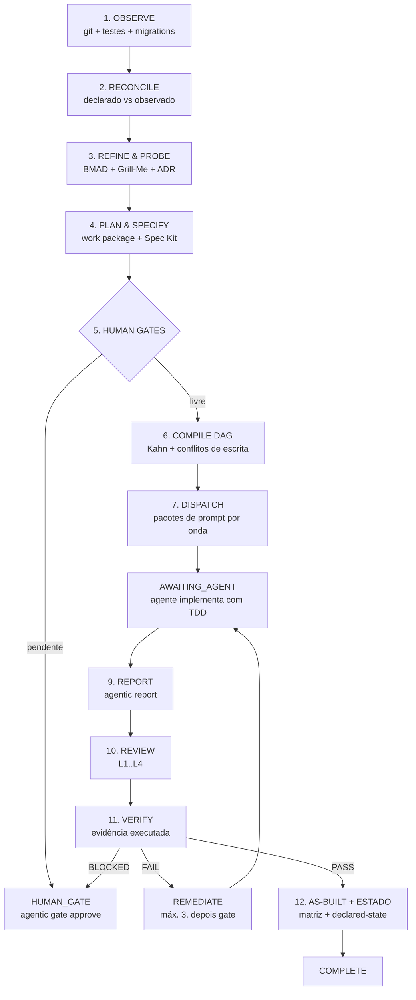

# Agentic SDLC Orchestrator

Framework de entrega de software **determinístico, orientado a estado e com fechamento condicionado a evidência**. Ele não escreve o seu código: ele estrutura o pedido, especifica o contrato, define quem pode escrever o quê, entrega o pacote de trabalho ao agente de codificação (Claude Code, Antigravity/Gemini, Codex, Ruflo ou um humano) e **só declara algo pronto contra a saída real da suíte de testes**.

---

## A ideia central: três responsabilidades que nunca se misturam

| Responsabilidade | Quem faz | Quem nunca faz |
| :--- | :--- | :--- |
| Estruturar, especificar, barrar risco, auditar | CLI `agentic` (determinístico, sem LLM) | o agente |
| Escrever código e testes | o agente de codificação | a CLI |
| Declarar que algo está PRONTO | o verificador, a partir de teste executado | os dois acima |

É daí que sai o formato de uso em **duas fases**:

```bash
# Fase 1 — estrutura e despacha (gera pacotes de prompt, nenhum código)
agentic prompt "Implementar rota de checkout com cartão de crédito"

# ... o agente implementa cada pacote de .agentic/execution/inbox/ com TDD estrito ...
agentic report TASK-001 --status completed --files "src/checkout/route.ts" --commit a1b2c3d

# Fase 2 — fecha com evidência real (roda a suíte, verifica, gera as-built, atualiza estado)
agentic verify
```

Entre as duas fases o run fica no estado `AWAITING_AGENT`. Isso **não é falha**: é o framework esperando implementação. Nada entra na matriz de requisitos antes de `agentic verify` obter um registro de evidência de uma execução real.

---

## Os invariantes (e como cada um é imposto no código)

| Invariante | Mecanismo de imposição |
| :--- | :--- |
| **Observado > Declarado** | `Observer` mede o repositório de verdade; status de teste não medido é reportado como `pending`, nunca como `pass`. `agentic reconcile --sync` reescreve o declarado a partir do observado. |
| **Nada PRONTO sem evidência** | `EvidenceCollector` é o único componente autorizado a afirmar que testes passaram: executa o comando, captura exit code, conta os testes, guarda o SHA-256 da saída completa. O `Verifier` recusa fechamento (`BLOCKED`) sem um registro `source: executed` com exit 0. |
| **Suposição não é decisão** | O Grill-Me marca cada resposta não humana como `assumed`. ADR nasce `PROPOSED` e só vira `ACCEPTED` quando todas as sondagens forem respondidas (`--answers arquivo.json`). Suposições viajam explicitamente dentro do pacote de prompt da tarefa. |
| **Especificação antes da implementação** | Contrato Spec Kit (`SPEC-###`, `REQ-###`, `AC-###.#`, Given-When-Then) gerado antes do despacho, com IDs sequenciais do registro (`.agentic/registry/ids.json`) — sem colisão entre pessoas e runs. |
| **TDD estrito** | Cada pacote de prompt exige RED → GREEN → REFACTOR com a saída de teste, e proíbe enfraquecer testes existentes. |
| **Autor ≠ verificador** | A verificação roda como `fresh_context`; em modo `local` a política bloqueia quando autor e verificador são a mesma identidade. |
| **Human gates barram** | `GateKeeper` avalia `gates.yaml` + `policies.yaml` **antes de qualquer despacho** e persiste a solicitação em `.agentic/gates/`. Segurança/autenticação, migração destrutiva, complexidade XL e remediação esgotada param o run. |
| **Ownership isolado** | Cada tarefa declara WRITE / READ-ONLY / FORBIDDEN; o compilador de DAG detecta ciclos (Kahn) e conflitos de escrita entre tarefas paralelas. |
| **Auditabilidade** | `events.jsonl` é uma cadeia de hash SHA-256 com ator, sequência e `prev_hash`. `agentic audit verify` detecta edição e remoção de eventos, e distingue isso de escrita concorrente. |
| **Loop idempotente** | Orçamento de remediação persistido por requisito (não por run, que seria trivial de burlar); `agentic run` retoma o run estacionado em vez de criar outro. |

---

## Fluxo completo do ciclo



---

## Instalação

```bash
npm install && npm run build && npm link
```

---

## Um comando por projeto

```bash
cd /caminho/do/projeto
agentic init
```

Isso faz tudo: cria a arquitetura `.agentic/`, **conecta todos os produtos de IA ao mesmo workflow**, declara a política de colaboração do time, observa o repositório e roda o diagnóstico — terminando com o que fazer a seguir.

Variações:

```bash
agentic init --agents claude,gemini        # só os produtos que o time usa
agentic init --with-ecc                    # ECC como engine de processo
agentic init --all                         # tenta instalar também os engines externos
agentic init --scaffold-only               # só o .agentic/, sem tocar em arquivos de IA
agentic init --without-hooks               # sem o hook de SessionStart do Claude Code
agentic init --without-permissions         # sem o allowlist em .claude/settings.json
```

`agentic setup` e `agentic bootstrap` são aliases de `init`, mantidos para scripts existentes.

---

## Um workflow, todos os produtos de IA

O protocolo é único; o que muda é o arquivo que cada produto lê e como você dispara. `agentic init` escreve tudo, e `agentic agents` mostra o estado.

| Produto | Como você usa | Arquivos gerados |
| :--- | :--- | :--- |
| **Claude Code** | `/agentic <pedido>` | `CLAUDE.md`, `.claude/commands/*.md` (9 comandos), `.claude/skills/agentic/`, `.claude/settings.json` |
| **Google Antigravity** | `/agentic <pedido>` | `AGENTS.md`, `.agents/skills/agentic/SKILL.md`, `.agents/workflows/*.md` |
| **Gemini CLI** | `/agentic <pedido>`, `/agentic:verify`, `/agentic:grill`… | `GEMINI.md`, `.gemini/commands/*.toml` |
| **OpenAI Codex** | pede normalmente — `AGENTS.md` rege a sessão | `AGENTS.md`, `CODEX.md` |
| **ChatGPT** (sem acesso ao repo) | cola `.agentic/agents/CHATGPT.md` e descreve a tarefa | `.agentic/agents/CHATGPT.md` |
| **Cursor** | pede normalmente — regra `alwaysApply` | `.cursor/rules/agentic.mdc` |
| **GitHub Copilot** | pede normalmente | `.github/copilot-instructions.md` |
| **Windsurf** | pede normalmente | `.windsurfrules` |

```bash
agentic agents                          # o que está conectado e o que existe nesta máquina
agentic agents sync                     # (re)escreve os arquivos de instrução
agentic agents sync --agents claude     # só um produto
agentic agents sync --force             # sobrescreve arquivos editados à mão
```

Três cuidados na geração:

1. **Arquivos escritos à mão são preservados.** Só sobrescrevemos o que o próprio framework gerou (detectado pelo cabeçalho) — a menos que você passe `--force`. `AGENTS.md` com regras suas continua intacto.
2. **`.claude/settings.json` é mesclado, nunca substituído.** O allowlist adiciona os comandos `agentic` às permissões existentes, e o hook de `SessionStart` (que mostra o estado do ciclo ao abrir a sessão) só é inserido uma vez. Decisões que precisam de humano — `gate approve`, `gate reject`, `team release` — **não** entram no allowlist de propósito.
3. **Arquivos injetados em toda requisição ficam curtos.** Cursor, Copilot e Windsurf recebem o protocolo compacto (~40 linhas); os arquivos longos vão para os produtos que os carregam sob demanda.

---

## Uso

### Terminal

```bash
agentic prompt "Criar tabela de produtos com migrations e validação Zod"
agentic prompt "Criar checkout Stripe" --answers answers.json   # decisões humanas
agentic prompt "Refatorar persistência" --strict                # recusa suposições
agentic grill "Desenhar arquitetura de notificações"            # só sondagem + ADR
agentic spec "Sistema de notificações em tempo real"            # só contrato
agentic report TASK-001 --status completed --commit a1b2c3d
agentic verify
```

### Claude Code

```text
/agentic implementar fila de e-mails com BullMQ
/agentic-grill desenhar arquitetura de microsserviços
/agentic-verify     /agentic-gate     /agentic-team
/agentic-skills     /agentic-status   /agentic-doctor
```

### Gemini CLI

```text
/agentic implementar fila de e-mails com BullMQ
/agentic:grill      /agentic:verify   /agentic:status
/agentic:gate       /agentic:skills
```

### Antigravity

```text
/agentic implementar fila de e-mails com BullMQ
/agentic-verify     /agentic-grill    /agentic-status
```

### Codex / Cursor / Copilot / Windsurf

Peça normalmente: o arquivo de instruções de cada um já obriga o fluxo de duas fases.

### ChatGPT

Cole `.agentic/agents/CHATGPT.md` numa conversa nova e descreva a tarefa. Como o ChatGPT não roda comandos, ele devolve os comandos `agentic` exatos para você executar e **espera a saída real** antes de continuar — nunca presume que passou.


---

## Trabalho em equipe

O ponto que separa "framework pessoal" de "framework de time":

```bash
agentic team who                    # identidade + todas as reivindicações ativas
agentic team claim P-012 --note "checkout"
agentic team release P-012
agentic team init                   # (re)declara o split compartilhado/local
```

- **Reivindicação (lease)**: o orquestrador **recusa** rodar uma fase reivindicada por outra pessoa; `--force` assume o controle e isso fica registrado na auditoria. Leases expiram (TTL padrão de 4h) para não travar o time.
- **Split de artefatos**: `specs/`, `decisions/`, `planning/`, `gates/`, `registry/`, `prompts/`, `templates/` e a matriz de requisitos são verdade compartilhada e vão para o Git. `state/observed-state.json`, `execution/runs/`, `execution/inbox/`, `execution/results/`, `verification/evidence/` e `team/leases/` são locais da máquina (`.agentic/.gitignore`) — era exatamente onde todo mundo conflitava em cada pull.
- **Auditoria mesclável**: `.agentic/audit/events.jsonl` usa `merge=union` e cadeia de hash; escrita concorrente aparece como *fork*, não como corrupção.
- **Identidade**: todo evento, lease, decisão de gate e fechamento registra `git config user.email` (ou `AGENTIC_ACTOR`).

---

## Tabela de comandos

| Comando | Descrição |
| :--- | :--- |
| `agentic prompt "<x>"` (alias `do`) | Estrutura a instrução (BMAD → Grill-Me → ADR → Spec Kit) e despacha os pacotes de prompt |
| `agentic report <TASK> --status <s>` | Devolve o resultado de uma tarefa ao orquestrador |
| `agentic verify` | Coleta evidência real, verifica, gera as-built e atualiza o estado |
| `agentic run [--phase <id>]` | Roda ou retoma o ciclo (`--no-resume`, `--dry-run`, `--force`) |
| `agentic grill "<x>" [--answers f.json]` | Sondagem adversarial e registro de ADR |
| `agentic spec "<x>"` | Somente o contrato Spec Kit |
| `agentic evidence [--show] [--command <cmd>]` | Executa a suíte e grava o registro de evidência |
| `agentic gate list \| approve <id> \| reject <id>` | Decisões de human gate |
| `agentic team init \| who \| claim \| release` | Coordenação de equipe |
| `agentic skills [list \| stage <s> \| install <pack>]` | Pacotes de skills por estágio e disponibilidade real |
| `agentic agents [list \| sync]` | Produtos de IA conectados ao workflow e (re)geração dos arquivos |
| `agentic init [--agents <lista>]` (aliases `setup`, `bootstrap`) | Configuração completa do projeto e das integrações |
| `agentic audit verify \| tail` | Integridade e histórico da auditoria |
| `agentic observe [--tests]` | Inspeção real do repositório (com medição opcional da suíte) |
| `agentic reconcile [--sync]` | Compara e (com `--sync`) aplica observado sobre declarado |
| `agentic status` | Painel: estado, requisitos, tarefas pendentes, gates, leases, próxima ação |
| `agentic doctor` | Diagnóstico: configs, capacidade de evidência, integridade, providers, time |
| `agentic ids [--kind REQ]` | Identificadores alocados |
| `agentic resume [--apply]` | Plano de retomada e retomada efetiva |
| `agentic providers` | Detecção real dos engines externos |
| `agentic migrate [--apply]` | Traz os artefatos de `.agentic/` para o schema atual |
| `agentic prompt "<x>" --split "<a>" --split "<b>" [--parallel]` | Decompõe um épico em fatias (REQ + contrato + tarefa por fatia) |
| `agentic worktree list \| clean` | Checkouts isolados das ondas paralelas |
| `agentic report ... --force` | Registra o report apesar de violar política (fica auditado) |

---

## Motores integrados

O framework tem implementação **nativa** de todos os papéis; os engines externos são melhorias, não pré-requisitos. `agentic providers` e `agentic doctor` mostram o que está realmente detectado nesta máquina em vez de assumir presença.

| Papel | Engine | Função |
| :--- | :--- | :--- |
| Refinamento de prompt | **BMAD** (nativo) | Briefing estruturado: Business, Modeling, Architecture, Delivery |
| Clarificação | **Grill-Me** (nativo) | Sondagem adversarial; separa decisão de suposição |
| Decisões | **Decision Recorder** (nativo) | ADRs sequenciais em `.agentic/specs/decisions/` |
| Especificação | **GitHub Spec Kit** / **TLC** | Contratos, matriz de AC, cenários Given-When-Then |
| Planejamento | **GSD** | Milestones, fases, work packages |
| Execução | **Ruflo** / delegado / `command` | Estratégia de execução e ponte com o agente |
| Processo | **Superpowers** / **ECC** | Disciplina de TDD e debugging sistemático |
| Técnicas por estágio | **mattpocock/skills** | Skills mapeadas por estágio (`skills.yaml`) |
| Verificação | **TLC Fresh Verifier** (nativo) | Verificação independente sobre evidência executada |

### Pacotes de skills (técnicas compartilhadas)

`.agentic/orchestrator/skills.yaml` mapeia skills externas para os estágios do ciclo, para que o time inteiro aplique a mesma técnica no mesmo passo. O pacote [`mattpocock/skills`](https://github.com/mattpocock/skills) vem mapeado por padrão:

| Estágio | Skill | Para quê |
| :--- | :--- | :--- |
| refine | `/grill-with-docs`, `/domain-modeling` | aprofundar o briefing BMAD e a terminologia do domínio |
| probe | `/grill-me`, `/grilling` | conduzir a entrevista real sobre as sondagens abertas |
| specify | `/to-spec` | enriquecer o SPEC gerado (IDs continuam vindo do registro) |
| architect | `/codebase-design`, `/improve-codebase-architecture` | fronteiras de módulo e oportunidades de refactor |
| compile | `/to-tickets` | decompor o work package (a DAG segue sendo a unidade executável) |
| prototype | `/prototype` | validação descartável de design |
| implement | `/implement`, `/tdd` | o próprio loop red-green-refactor |
| review | `/code-review` | camadas L1 e L3 da revisão |
| remediate | `/diagnosing-bugs` | debugging sistemático quando o teste não fica verde |
| merge | `/resolving-merge-conflicts` | resolver conflito por intenção |
| handoff | `/handoff` | compactar a sessão antes de perder contexto |
| triage / plan_multi_session | `/triage`, `/wayfinder` | estado de issues e planejamento multi-sessão |

```bash
agentic skills                              # o que está mapeado e o que está instalado aqui
agentic skills stage implement --installed  # o que usar durante a implementação
agentic skills install mattpocock           # imprime o comando (--run executa)
```

Instalação: `claude plugins install mattpocock-skills` (Claude Code) ou `npx skills@latest add mattpocock/skills` (outros agentes), seguido de `/setup-matt-pocock-skills` uma vez por repositório.

Três regras mantêm a integração honesta:

1. **Detecção real.** Uma skill só é recomendada ao agente quando o pacote é encontrado em disco (`.claude/plugins/*mattpocock*`, `.agents/skills/to-spec`, …). Pacote ausente aparece no prompt pack como "not installed — do not invoke", e no `doctor` como WARN, nunca FAIL: nenhum estágio depende de pacote externo.
2. **IDs continuam do registro.** Uma skill pode enriquecer um spec; não pode emitir `REQ-###`/`AC-###.#`.
3. **Evidência continua do `agentic verify`.** Skill relatando "testes passaram" não é evidência.

> **Colisão de nome resolvida:** `/grill-me` é a skill de entrevista do pacote. A sondagem determinística + registro de ADR do framework passou a ser `/agentic-grill` (CLI: `agentic grill`). As duas compõem — a CLI produz o conjunto de perguntas, a skill conduz a conversa.

---

### Modo de execução

`providers.yaml → execution.mode`:

- **`delegated`** (padrão): grava os pacotes de prompt em `.agentic/execution/inbox/` e espera `agentic report`. É o modo usado por Claude Code / Antigravity / Codex.
- **`command`**: entrega cada tarefa a um comando configurado; o exit code vira o resultado da tarefa.

```yaml
execution:
  engine: ruflo
  mode: command
  command: 'claude -p "$(cat {{prompt_file}})"'   # {{contract_file}}, {{task_id}}, {{domain}}
```

---

## Estrutura de `.agentic/`

```text
.agentic/
├── orchestrator/      # workflow, state-machine, policies, gates, routing, providers, complexity, evidence, skills + schemas
├── registry/          # ids.json — alocação sequencial de REQ/SPEC/ADR/TASK/RUN  [compartilhado]
├── state/             # observed-state, declared-state, reconciled-state, diff   [local, exceto declared]
├── planning/          # current-work-package.yaml + histórico                     [compartilhado]
├── specs/             # planned/ (contratos), decisions/ (ADR), as-built/         [compartilhado]
├── tasks/             # dag.json + contratos de tarefa
├── execution/         # inbox/ (pacotes de prompt), results/ (reports), runs/     [local]
├── verification/      # requirement-matrix.json [compartilhado] + evidence/ e reports/ [local]
├── gates/             # solicitações de human gate e suas decisões                [compartilhado]
├── team/leases/       # reivindicações ativas de fase/tarefa                       [local]
├── reconciliation/    # regras e relatórios
├── prompts/           # briefings BMAD e prompts de papel
├── templates/         # modelos de work package, tarefa e remediação
└── audit/             # events.jsonl — cadeia de hash SHA-256, append-only        [compartilhado, merge=union]
```

---

## Políticas aplicadas (não só declaradas)

`policies.yaml` sempre descreveu a governança; agora o código a executa. Toda requisição é **classificada** (`feature`, `bugfix`, `bugfix_small`, `refactor`, `database_change`, `architecture_change`, `documentation_only`, `config_only`, `generated_code`) e a classificação fica gravada no work package — é a chave que faltava para as regras por tipo de mudança.

| Política | Onde é imposta | O que acontece |
| :--- | :--- | :--- |
| `spec_required.<tipo>` | antes do despacho | run vai a `BLOCKED` se o tipo exige contrato e não há nenhum |
| `tdd.<tipo>` | em `agentic report` | `--status completed` sem `--tests` é **recusado** quando TDD é `required` |
| `git.atomic_commit_per_task` | em `agentic report` | recusa report sem `--commit`, e verifica que o sha **resolve** no git |
| `worktree.parallel_agents` | no despacho | cria worktree isolada por tarefa quando a onda tem mais de uma |
| `loop.reobserve_after_success` | no fechamento | reobserva o repositório só quando a política pede |
| `documentation.generate_as_built` | no fechamento | as-built só é gerado se a política mandar |

```
x Report rejected by 1 policy rule(s):
    - [policies.tdd.feature] This work is classified 'feature' (adds new behaviour),
      for which TDD is required, but the report lists no test file.
      Report the tests you wrote: agentic report TASK-001 --status completed --tests "<test files>"
  Fix the report, or record it as a deliberate exception with --force.
```

`--force` registra a exceção no resultado da tarefa **e** no stream de auditoria (`POLICY_OVERRIDDEN`) — a saída de emergência existe, mas fica rastreável.

---

## Decomposição, ondas e worktrees

Até aqui todo pedido virava um requisito, uma tarefa, uma onda — o DAG, os grupos paralelos e a detecção de conflito de escrita existiam sem nunca serem exercitados. Agora você decompõe explicitamente:

```bash
agentic prompt "Entregar checkout completo"   --split "criar endpoint de pedido no modulo api"   --split "criar tela de checkout no modulo web"   --parallel
```

Cada fatia recebe **REQ próprio, contrato Spec Kit próprio e tarefa própria**, com escopo detectado por módulo. O framework não inventa a decomposição — decompor um épico é decisão de projeto; o que ele faz é compilar a que você declarou.

Três regras governam as ondas:

1. **Sequencial por padrão.** Sem `--parallel`, cada fatia depende da anterior.
2. **Paralelo só quando é seguro.** Com `--parallel`, fatias independentes compartilham a onda — mas o compilador **serializa automaticamente** qualquer par cujos caminhos de escrita se sobreponham. Declarar paralelismo não autoriza corrida.
3. **Isolamento real.** Quando uma onda tem mais de uma tarefa e `worktree.parallel_agents: required`, cada tarefa ganha uma worktree git própria (`.agentic/worktrees/<TASK>`, branch `agentic/<run>/<task>`), e o pacote de prompt manda trabalhar lá dentro.

```bash
agentic worktree list     # o que existe
agentic worktree clean    # remove as checkouts (branches são preservados)
agentic prompt "..." --no-worktrees   # desliga o isolamento
```

As branches nunca são apagadas na limpeza: podem conter trabalho não mesclado, e apagar commit de alguém para "arrumar a casa" seria o oposto do que o framework promete.

---

## Versionamento dos artefatos

Todo artefato escrito em `.agentic/` carrega `schema_version`. Isso existe porque o framework relê o próprio estado a cada run: sem o carimbo, um artefato escrito por uma versão antiga é indistinguível de um atual e passa a ser lido com as suposições erradas.

| Versão | O que mudou |
| :--- | :--- |
| v1 | implícita. Runs podiam chegar a `COMPLETE` sem registro de evidência, e o observer reportava `tests.status: pass` sem executar nada. |
| **v2** | atual. Fechamento exige evidência executada; status de teste não medido é `pending`; o run carrega `dispatch` e `evidence`. |

```bash
agentic migrate            # dry run: mostra o que será feito
agentic migrate --apply    # aplica
```

A migração é **conservadora ao preservar e estrita ao afirmar**: nada é apagado, mas toda alegação que o pipeline antigo conseguia produzir sem prova é rebaixada para o que as regras atuais conseguem justificar.

| Achado | O que a migração faz |
| :--- | :--- |
| run `COMPLETE` sem evidência | aposenta o run (`STOPPED`) e registra o motivo |
| `tests.status: pass` sem `evidence_id` | vira `pending` (não medido) + risco declarado |
| requisito `verified` sem `evidence` | rebaixa para `tested: false, verified: false` com nota |
| artefato de build mais novo | **recusa migrar** e manda atualizar a CLI |

Enquanto houver artefato desalinhado, `agentic status` mostra `LEGACY (older schema)` em vez de repetir um status que não pode provar, e o `doctor` falha em **Artifact schema**. Os artefatos também são validados contra os JSON Schemas que o framework já publicava (`Artifact validation`) — antes eles existiam e nunca eram usados.

---

## Configuração de evidência

`.agentic/orchestrator/evidence.yaml` define como a evidência é produzida:

```yaml
evidence:
  test_command: ""            # vazio = autodetecta npm/pytest/go/cargo/mvn
  timeout_ms: 900000
  output_tail_chars: 4000     # a saída completa é sempre hasheada (SHA-256)
  require_clean_tree: false
  run_tests_on_observe: false # quando false, observe reporta `pending` (não medido)
```

---

## Desenvolvimento

```bash
npm test              # 183 testes
npm run build
npm run verify:self   # doctor + integridade da auditoria
```

CI (`.github/workflows/ci.yml`) roda em Node 20 e 22: type check, build e suíte; depois o framework se autoverifica (`migrate`, `audit verify`, `doctor`) e faz um smoke de `init` + fluxo de duas fases num projeto descartável, exigindo que o requisito feche **com evidência**.
