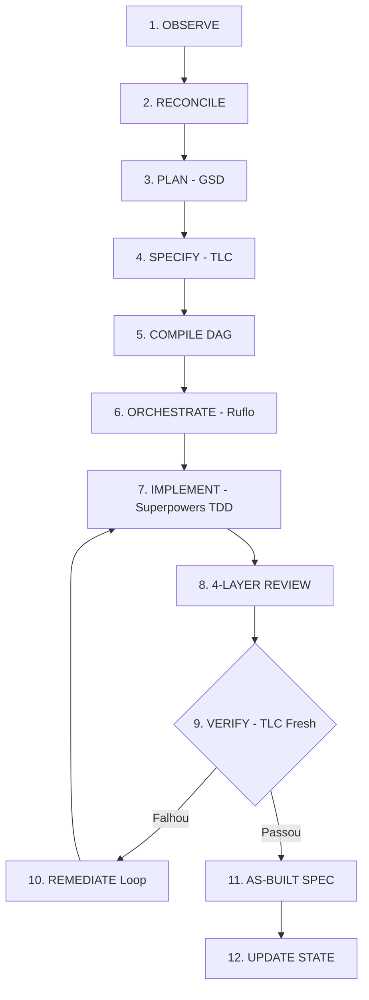

# Agentic SDLC Orchestrator

O **Agentic SDLC Orchestrator** é um framework de entrega de software autônomo e baseado em estados. Ele orquestra os melhores frameworks e metodologias do ecossistema de engenharia de IA (**GSD, TLC, Ruflo e Superpowers**) através de um ciclo rigoroso de **12 etapas não-negociáveis**.

---

## ⚡ Invariantes Não-Negociáveis

1. **Observed State > Declared State**: O código real, testes, branches e schemas do repositório sempre prevalecem sobre qualquer documentação declarada.
2. **Nenhum Requisito Concluído sem Evidência**: Requisitos só fecham como `DONE` quando `implemented && tested && verified`.
3. **Especificação Antes da Implementação**: Contratos formais com IDs rastreáveis (`REQ-###`, `AC-###.#`, `TASK-###`).
4. **TDD Estrito Obrigatório**: Red -> Green -> Refactor para qualquer mudança de código não-trivial.
5. **Fresh Verifier**: Verificação independente com contexto limpo antes do fechamento do ciclo.
6. **As-Built Spec a partir da Realidade**: Documentação extraída do git diff e evidências de teste reais.

---

## 🚀 Guia Rápido: Usando em Qualquer Novo Projeto

### Passo 1: Instalação Global do CLI (Feita uma única vez na máquina)

Na pasta deste repositório (`framework_agentic`):

```bash
# 1. Instalar dependências e compilar
npm install
npm run build

# 2. Registrar o comando 'agentic' globalmente no sistema operacional
npm link
```

---

### Passo 2: Inicializar o Framework no seu Novo Projeto

Abra o terminal em **qualquer projeto novo ou existente** (ex: `meu-app`):

```bash
cd /caminho/para/meu-app

# 1. Executar o setup completo (Padrão com Superpowers):
agentic setup

# 2. Ou usar o ECC (Everything Claude Code) como Process Engine:
agentic setup --with-ecc

# 3. Ou escolher componentes específicos (modular):
agentic setup --process ecc --without-gsd --without-ruflo
```

#### Opções de Customização do `agentic setup`:
| Flag | Descrição |
| :--- | :--- |
| `--with-ecc` | Usa o **ECC** (Enterprise Coding Capabilities) no lugar do Superpowers |
| `--process <engine>` | Escolhe o motor de processo (`superpowers`, `ecc` ou `native`) |
| `--without-gsd` | Desativa o GSD e usa o planejador nativo |
| `--without-tlc` | Desativa o TLC e usa o especificador/verificador nativo |
| `--without-ruflo` | Desativa o Ruflo e usa o executor nativo |
| `--without-rules` | Não gera os arquivos `AGENTS.md`, `GEMINI.md`, `CLAUDE.md`, `CODEX.md` |
| `--without-commands` | Não gera os comandos slash do Claude Code / Antigravity |
| `--all` | Tenta instalar automaticamente os engines externos via terminal |
| `-f, --force` | Sobrescreve arquivos de configuração existentes |

#### O que o `agentic setup` faz automaticamente:
- ✅ Inicializa o repositório Git (se ainda não existir).
- ✅ Faz o scaffold da arquitetura completa `.agentic/` (schemas JSON, templates, configs YAML, políticas de segurança).
- ✅ Configura o motor de processo escolhido (**Superpowers** ou **ECC**).
- ✅ Configura as regras para IA no workspace (`AGENTS.md`, `GEMINI.md`, `CLAUDE.md`, `CODEX.md`).
- ✅ Instala a Skill para o **Antigravity** (`.agents/skills/agentic/SKILL.md`).
- ✅ Instala os Slash Commands para o **Claude Code** (`.claude/commands/`).
- ✅ Executa a observação inicial do repositório (`observed-state.json`) e reconciliação.
- ✅ Executa o diagnóstico do `Doctor` garantindo status **READY**.

---

### Passo 3: Validar a Prontidão do Projeto

No diretório do seu projeto:

```bash
agentic doctor
```

Você verá o diagnóstico de todos os componentes:
```text
========================================
      Agentic SDLC Doctor Diagnostic     
========================================

Git repository             [PASS  ] — Initialized and working
Orchestrator Configs       [PASS  ] — All YAML configurations valid
Config Schemas             [PASS  ] — All 6 schemas loaded
Observed State             [PASS  ] — observed-state.json exists
Requirement Matrix         [PASS  ] — requirement-matrix.json present
Audit Log                  [PASS  ] — events.jsonl active
GSD Planner Provider       [PASS  ] — Engine: gsd
TLC Spec & Verifier        [PASS  ] — Engine: tlc-spec-driven (Fresh Context: true)
Ruflo Execution Provider   [PASS  ] — Engine: ruflo (Fallback: native-agent)
Superpowers Process Provider [PASS  ] — Engine: superpowers

>>> STATUS: READY — All critical components verified.
========================================
```

---

## 🛠️ Como Executar Tarefas e Prompts

### Opção A: Pelo Terminal / CLI (Qualquer Prompt Livre)

Passe qualquer instrução em linguagem natural. O orquestrador detecta o domínio, calcula a complexidade, compila o grafo de tarefas (DAG), roda o TDD, revisa e valida:

```bash
# Executar prompt livre:
agentic prompt "Criar autenticação JWT com refresh token e middleware de proteção"

# Ou usando o alias 'agentic do':
agentic do "Adicionar migration da tabela orders e endpoint de listagem com paginação"
```

---

### Opção B: No Antigravity (Google DeepMind)

No chat do Antigravity, você pode:
1. Digitar o comando `/agentic`:
   ```text
   /agentic implementar sistema de notificações por email
   ```
2. Ou simplesmente mandar seu prompt normal. As regras [`AGENTS.md`](./AGENTS.md) e [`GEMINI.md`](./GEMINI.md) instruem o assistente a sempre seguir o ciclo de 12 passos.

---

### Opção C: No Claude Code (Anthropic)

No terminal do Claude Code, utilize os comandos slash instalados:
```bash
/agentic criar tela de perfil com upload de avatar
/agentic-status
/agentic-doctor
/agentic-run
```

---

### Opção D: No ChatGPT / OpenAI Codex

O arquivo [`CODEX.md`](./CODEX.md) na raiz do projeto orienta o Codex e Custom GPTs a utilizarem o pipeline de 12 etapas com TDD estrito e verificação independente.

---

## 📖 Referência Rápida de Comandos CLI

| Comando | Descrição |
| :--- | :--- |
| `agentic setup [--all] [--target <path>]` | Configura e instala o framework por completo em um projeto. |
| `agentic prompt "<instrução>"` (alias `do`) | Auto-orquestra qualquer instrução através do ciclo SDLC de 12 etapas. |
| `agentic doctor` | Executa bateria de testes diagnósticos de prontidão do framework. |
| `agentic status` | Exibe o painel em tempo real de requisitos, fase e testes. |
| `agentic observe` | Inspeciona Git, testes, branches e schemas reais do projeto. |
| `agentic reconcile` | Compara estado declarado vs realidade observada. |
| `agentic run [--phase <id>]` | Executa o ciclo de entrega da fase especificada. |
| `agentic resume` | Recupera e retoma execuções interrompidas com segurança a partir do checkpoint. |
| `agentic providers` | Exibe o status de integração dos provedores (GSD, TLC, Ruflo, Superpowers). |

---

## 🔄 O Ciclo de 12 Etapas



1. **OBSERVE**: Inspeciona branch, commit, dirty files, testes e migrações reais.
2. **RECONCILE**: Classifica divergências entre estado declarado e realidade observada.
3. **PLAN (GSD)**: Delimita milestone, fase e gera o pacote de trabalho (`WorkPackage`).
4. **SPECIFY (TLC)**: Especifica contratos formais (`REQ-###`, `AC-###.#`).
5. **COMPILE DAG**: Constrói grafo de dependências com algoritmo de Kahn (bloqueia ciclos e conflitos de escrita).
6. **ORCHESTRATE (RUFLO)**: Escolhe a estratégia de execução com base na complexidade (XS/S: Single agent, M: Paralelo, L/XL: Swarm).
7. **IMPLEMENT (SUPERPOWERS)**: Ciclo TDD estrito (RED -> GREEN -> REFACTOR) e isolamento em worktrees.
8. **REVIEW**: Revisão em 4 camadas (L1 Worker, L2 Build/Test, L3 Corretude, L4 Segurança Read-Only).
9. **VERIFY (TLC FRESH VERIFIER)**: Verificação independente com contexto limpo.
10. **REMEDIATE**: Loop de autocorreção em caso de falha (até 3 tentativas antes do Human Gate).
11. **AS-BUILT SPEC**: Extração de documentação fiel a partir do git diff e relatórios de teste.
12. **UPDATE STATE**: Atualiza a matriz de requisitos (`requirement-matrix.json`) e fecha o ciclo.

---

## 📁 Estrutura de Diretórios `.agentic/`

```text
.agentic/
├── orchestrator/      # Configurações centrais YAML (workflow, state-machine, policies, routing, providers)
├── schemas/           # Schemas JSON formais de validação (work-package, task, verification, run, etc.)
├── state/             # Estado observado real, estado declarado e reconciliado
├── planning/          # Pacotes de trabalho ativos (current-work-package.yaml) e histórico
├── specs/             # Especificações planejadas e As-Built geradas pós-verificação
├── tasks/             # DAG compilada (dag.json) e histórico de tarefas
├── execution/         # Descritor do run ativo (current-run.json) e logs de execução
├── verification/      # Relatórios de verificação e requirement-matrix.json
├── prompts/           # Prompts padronizados de papéis (Observer, Reconciler, Reviewer, Verifier, etc.)
├── templates/         # Modelos estruturados de trabalho, tarefas e remediação
└── audit/             # Stream append-only de auditoria com hash SHA-256 (events.jsonl)
```
