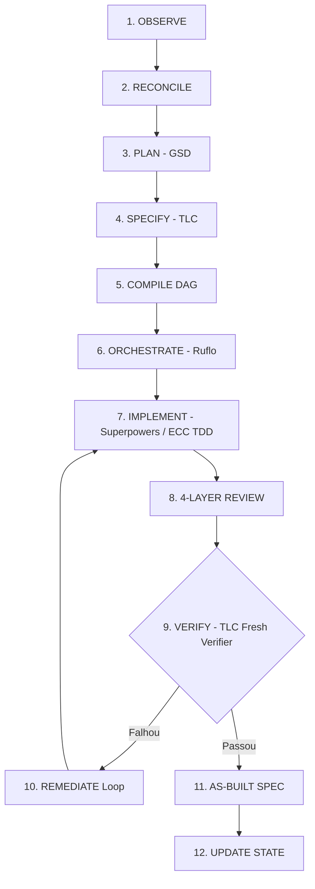

# Agentic SDLC Orchestrator

O **Agentic SDLC Orchestrator** é um framework de entrega de software autônomo, determinístico e baseado em estados. Ele orquestra os melhores frameworks e ferramentas de engenharia de software com IA (**GSD, TLC, Ruflo, Superpowers e ECC**) através de um pipeline rigoroso de **12 etapas não-negociáveis**.

---

## ⚡ Os 6 Invariantes Não-Negociáveis

1. **Observed State > Declared State**: A realidade do código (`git status`, testes, branches, schemas e migrations) sempre se sobrepõe a qualquer documentação declarada.
2. **Nenhum Requisito Concluído sem Evidência**: Nenhum requisito é marcado como `DONE` sem prova de execução (`implemented && tested && verified`).
3. **Especificação Antes da Implementação**: Contratos formais com identificadores únicos e estáveis (`REQ-###`, `AC-###.#`, `TASK-###`).
4. **TDD Estrito Obrigatório**: Ciclo Red -> Green -> Refactor para toda mudança de código não-trivial.
5. **Fresh Verifier (Verificador Independente)**: Verificação de critérios de aceitação executada com contexto limpo e isolado.
6. **As-Built Spec a partir da Realidade**: Documentação final extraída do git diff real e das evidências de testes aprovados.

---

## 🧩 Motores e Provedores Integrados

O framework permite utilizar o ecossistema completo ou escolher de forma modular quais motores ativar:

| Categoria | Motor Padrão | Alternativa / Opcional | Descrição |
| :--- | :--- | :--- | :--- |
| **Planejamento** | **GSD** (*Get Shit Done*) | `native-planner` | Delimitação de milestones, fases e pacotes de trabalho (`WorkPackage`). |
| **Especificação** | **TLC** (*Tech Leads Club*) | `native-spec` | Contratos formais de requisitos e critérios de aceitação. |
| **Execução & Swarm** | **Ruflo** | `native-swarm` / `native-agent` | Estratégia de execução adaptativa (Single Agent, Paralelo, Swarm). |
| **Processo & TDD** | **Superpowers** | **ECC** (*Everything Claude Code*) / `native-tdd` | Disciplina de engenharia, TDD estrito, debugging sistemático e isolamento em worktrees. |
| **Verificação** | **TLC Fresh Verifier** | `native-verifier` | Verificação independente com contexto isolado e fechamento da matriz de requisitos. |

> 💡 **Superpowers vs ECC**: Você pode alternar facilmente entre **Superpowers** (focado em disciplina TDD e worktrees) e **ECC** (focado em suíte corporativa com `tdd-workflow`, `verification-loop`, `security-review` e `agentic-engineering`).

---

## 🚀 Guia Rápido de Instalação e Uso

### Passo 1: Instalar o CLI Globalmente (Feito uma única vez na máquina)

Na pasta deste repositório (`framework_agentic`):

```bash
# 1. Instalar dependências e compilar o TypeScript
npm install
npm run build

# 2. Registrar o comando 'agentic' globalmente no sistema operacional
npm link
```

---

### Passo 2: Inicializar o Framework em Qualquer Projeto

Navegue até a pasta de qualquer projeto novo ou existente (ex: `meu-app`):

```bash
cd /caminho/para/meu-app
```

#### Opção A: Instalação Completa Padrão (com Superpowers)
```bash
agentic setup
```

#### Opção B: Instalação com ECC (Enterprise Coding Capabilities)
```bash
agentic setup --with-ecc
```

#### Opção C: Instalação Modular Personalizada
Você pode desativar ou substituir qualquer parte da biblioteca conforme a necessidade do seu projeto:

```bash
# Exemplo 1: Usar ECC, mas sem GSD e sem Ruflo
agentic setup --process ecc --without-gsd --without-ruflo

# Exemplo 2: Usar TDD nativo sem ferramentas externas
agentic setup --process native --without-gsd --without-tlc --without-ruflo

# Exemplo 3: Instalação silenciosa sem gerar arquivos de regras na raiz
agentic setup --without-rules --without-commands
```

---

### 🎛️ Todas as Opções do `agentic setup`

| Flag | Tipo | Padrão | Descrição |
| :--- | :--- | :--- | :--- |
| `-t, --target <path>` | `string` | CWD | Diretório de destino do projeto. |
| `--process <engine>` | `superpowers \| ecc \| native` | `superpowers` | Escolhe o motor de processo de implementação e TDD. |
| `--with-ecc` | `boolean` | `false` | Atalho para selecionar o **ECC** como motor de processo. |
| `--without-gsd` | `boolean` | `false` | Desativa o GSD e utiliza o planejador nativo. |
| `--without-tlc` | `boolean` | `false` | Desativa o TLC e utiliza o especificador/verificador nativo. |
| `--without-ruflo` | `boolean` | `false` | Desativa o Ruflo e utiliza o executor/swarm nativo. |
| `--without-rules` | `boolean` | `false` | Não gera os arquivos `AGENTS.md`, `GEMINI.md`, `CLAUDE.md`, `CODEX.md`. |
| `--without-commands` | `boolean` | `false` | Não gera os comandos slash do Claude Code / Antigravity. |
| `--all` | `boolean` | `false` | Tenta instalar automaticamente os pacotes externos no sistema. |
| `-f, --force` | `boolean` | `false` | Sobrescreve arquivos e configurações existentes. |

#### O que o `agentic setup` realiza automaticamente:
1. **Inicialização do Git**: Inicializa o repositório Git caso ainda não exista.
2. **Scaffold Completo**: Cria toda a estrutura `.agentic/` (schemas JSON, templates, políticas e configs YAML).
3. **Configuração de Motores**: Configura o arquivo `providers.yaml` com a seleção feita (Superpowers, ECC, GSD, TLC, etc.).
4. **Regras de Workspace para IAs**: Cria `AGENTS.md`, `GEMINI.md`, `CLAUDE.md` e `CODEX.md` para que qualquer assistente siga o ciclo de 12 etapas por padrão.
5. **Skill para o Antigravity**: Instala a skill `.agents/skills/agentic/SKILL.md`.
6. **Slash Commands para o Claude Code**: Instala os comandos em `.claude/commands/`.
7. **Observação & Reconciliação Inicial**: Mapeia o estado real do projeto (`observed-state.json`).
8. **Diagnóstico do Doctor**: Executa a validação de saúde do projeto emitindo o relatório final.

---

### Passo 3: Verificar a Saúde do Framework (`agentic doctor`)

No diretório do seu projeto:

```bash
agentic doctor
```

Exemplo de saída de diagnóstico:
```text
========================================
      Agentic SDLC Doctor Diagnostic     
========================================

Git repository             [PASS  ] — Initialized and working
Orchestrator Configs       [PASS  ] — All YAML configurations valid
Config Schemas             [PASS  ] — All 6 schemas loaded
Observed State             [PASS  ] — observed-state.json exists
Requirement Matrix         [PASS  ] — requirement-matrix.json present
Audit Log                  [PASS  ] — events.jsonl active
GSD Planner Provider       [PASS  ] — Engine: gsd
TLC Spec & Verifier        [PASS  ] — Engine: tlc-spec-driven (Fresh Context: true)
Ruflo Execution Provider   [PASS  ] — Engine: ruflo (Fallback: native-agent)
Process Provider           [PASS  ] — Engine: superpowers (or ECC)

>>> STATUS: READY — All critical components verified.
========================================
```

---

## 🤖 Como Executar Prompts e Tarefas

### 1. Pelo Terminal / CLI (Qualquer Prompt Livre)

O **Auto-Orquestrador** ingere qualquer instrução em linguagem natural, deduz o domínio, dimensiona a complexidade (XS a XL), compila a DAG sem ciclos, aplica o TDD e entrega o relatório de verificação e a especificação As-Built:

```bash
# Executar qualquer instrução:
agentic prompt "Implementar rota de autenticação JWT com refresh token e middleware de proteção"

# Usando o alias 'agentic do':
agentic do "Criar tabela de produtos com migrations Knex e validação Zod"
```

---

### 2. No Antigravity (Google DeepMind)

No chat do Antigravity:
- Digite o comando `/agentic`:
  ```text
  /agentic criar tela de checkout com Stripe
  ```
- Ou envie seu prompt normalmente. As regras em [`AGENTS.md`](./AGENTS.md) e [`GEMINI.md`](./GEMINI.md) instruem o assistente a sempre seguir o ciclo de 12 etapas.

---

### 3. No Claude Code (Anthropic)

Utilize os comandos slash nativos:
```bash
/agentic implementar fila de processamento de emails com BullMQ
/agentic-status
/agentic-doctor
/agentic-run
```

---

### 4. No ChatGPT / OpenAI Codex

O arquivo [`CODEX.md`](./CODEX.md) na raiz do projeto instrui o Codex e Custom GPTs a aplicarem a máquina de estados, TDD estrito e verificação independente.

---

## 📋 Tabela Completa de Comandos CLI

| Comando | Descrição |
| :--- | :--- |
| **`agentic setup [opções]`** | Configura e instala o framework por completo (completo ou modular com flags). |
| **`agentic prompt "<prompt>"`** (alias **`do`**) | Auto-orquestra qualquer instrução em linguagem natural pelo ciclo de 12 etapas. |
| **`agentic doctor`** | Executa bateria de testes diagnósticos de prontidão do framework e provedores. |
| **`agentic status`** | Exibe o painel em tempo real de requisitos, fase atual e histórico de testes. |
| **`agentic observe`** | Inspeciona branches, commits, testes, dirty files e schemas reais do repositório. |
| **`agentic reconcile`** | Compara o estado declarado vs a realidade observada (`Observed > Declared`). |
| **`agentic run [--phase <id>]`** | Executa o ciclo de entrega da fase especificada. |
| **`agentic resume`** | Retoma com segurança execuções interrompidas a partir do último checkpoint (`current-run.json`). |
| **`agentic providers`** | Lista e inspeciona o status de integração dos provedores (GSD, TLC, Ruflo, Superpowers, ECC). |
| **`agentic init`** | Inicializa a estrutura `.agentic` básica no projeto. |
| **`agentic bootstrap`** | Executa inicialização rápida em repositórios brownfield ou greenfield. |

---

## 🔄 O Ciclo de 12 Etapas Detalhado



1. **OBSERVE**: Inspeciona branch, commit, dirty files, testes e migrações reais.
2. **RECONCILE**: Classifica divergências entre estado declarado e realidade observada.
3. **PLAN (GSD)**: Delimita milestone, fase e gera o pacote de trabalho (`WorkPackage`).
4. **SPECIFY (TLC)**: Especifica contratos formais com IDs estáveis (`REQ-###`, `AC-###.#`).
5. **COMPILE DAG**: Constrói grafo de dependências com algoritmo de Kahn (bloqueia ciclos e previne conflitos de escrita concorrente).
6. **ORCHESTRATE (RUFLO)**: Escolhe a estratégia de execução com base na complexidade (XS/S: Single agent, M: Paralelo, L/XL: Swarm).
7. **IMPLEMENT (SUPERPOWERS / ECC)**: Ciclo TDD estrito (RED -> GREEN -> REFACTOR) e isolamento em worktrees.
8. **REVIEW**: Revisão em 4 camadas (L1 Worker, L2 Build/Test, L3 Corretude, L4 Segurança Read-Only).
9. **VERIFY (TLC FRESH VERIFIER)**: Verificação independente com contexto limpo (nenhum requisito é fechado sem teste executado).
10. **REMEDIATE**: Loop de autocorreção em caso de falha (até 3 tentativas automáticas antes do Human Gate).
11. **AS-BUILT SPEC**: Extração de documentação fiel a partir do git diff e relatórios de teste reais.
12. **UPDATE STATE**: Atualiza a matriz de requisitos (`requirement-matrix.json`) e fecha o ciclo de entrega.

---

## 📁 Estrutura do Diretório `.agentic/`

```text
.agentic/
├── orchestrator/      # Configurações centrais YAML (workflow, state-machine, policies, routing, providers, complexity, gates)
├── schemas/           # Schemas JSON formais de validação (work-package, task, verification, run, requirement-closure)
├── state/             # Estado observado real (observed-state.json), estado declarado e reconciliado
├── planning/          # Pacotes de trabalho ativos (current-work-package.yaml) e histórico
├── specs/             # Especificações planejadas e As-Built geradas pós-verificação (planned/, as-built/)
├── tasks/             # DAG compilada (dag.json) e histórico de tarefas
├── execution/         # Descritor do run ativo (current-run.json) e logs de execução
├── verification/      # Relatórios de verificação e matriz de fechamento (requirement-matrix.json)
├── reconciliation/    # Regras e relatórios de reconciliação de estado
├── prompts/           # Prompts padronizados de papéis (Observer, Reconciler, Reviewer, Verifier, Task-Compiler, etc.)
├── templates/         # Modelos estruturados de pacotes de trabalho, tarefas e remediação
└── audit/             # Stream append-only de auditoria com hash SHA-256 (events.jsonl)
```

---

## 🛡️ Suíte de Testes e Qualidade

O framework possui **100% de cobertura de testes** em todos os seus módulos:

```bash
npm test
```

```text
 ✓ tests/recovery.test.ts (1 test)
 ✓ tests/task-compiler.test.ts (4 tests)
 ✓ tests/as-built.test.ts (1 test)
 ✓ tests/requirement-closure.test.ts (2 tests)
 ✓ tests/complexity-routing.test.ts (5 tests)
 ✓ tests/remediation-loop.test.ts (2 tests)
 ✓ tests/state-machine.test.ts (5 tests)
 ✓ tests/doctor.test.ts (1 test)
 ✓ tests/observer-reconciler.test.ts (3 tests)
 ✓ tests/scaffolder.test.ts (1 test)
 ✓ tests/orchestrator-e2e.test.ts (1 test)
 ✓ tests/setup-orchestrator.test.ts (2 tests)
 ✓ tests/prompt-orchestrator.test.ts (2 tests)

 Test Files  13 passed (13)
      Tests  30 passed (30)
```
